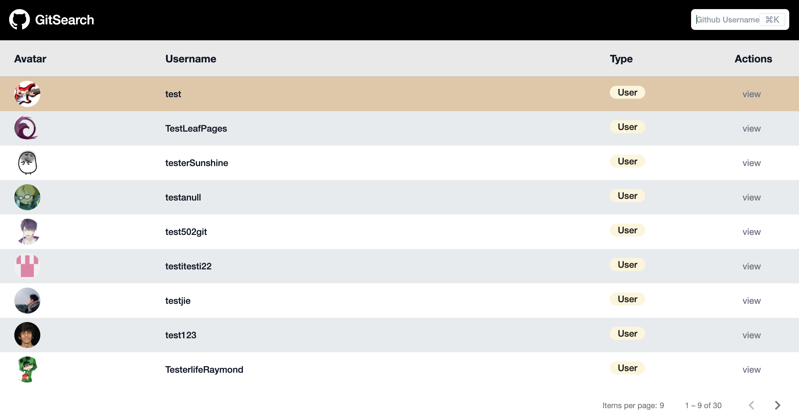

# Gitsearch

A search application that queries for github users via their username. It makes calls to the github API `https://api.github.com/search/users?q={login} in:login`.

TechStack:  Angular 13 | TypeScipt | Angular Material | Tailwind CSS.

## Development server

Run `ng serve` for a dev server. Navigate to `http://localhost:4200/`. The app will automatically reload if you change any of the source files.

## Build

Run `ng build` to build the project. The build artifacts will be stored in the `dist/` directory.

## Running unit tests

Run `ng test` to execute the unit tests via [Karma](https://karma-runner.github.io).

## Running end-to-end tests

Run `ng e2e` to execute the end-to-end tests via a platform of your choice. To use this command, you need to first add a package that implements end-to-end testing capabilities.

## Bugs

The loader only shows on first app load, the loader does not appear on subsequent searches.

## Upcoming improvements/features

Currently adding more unit test cases to the application.

